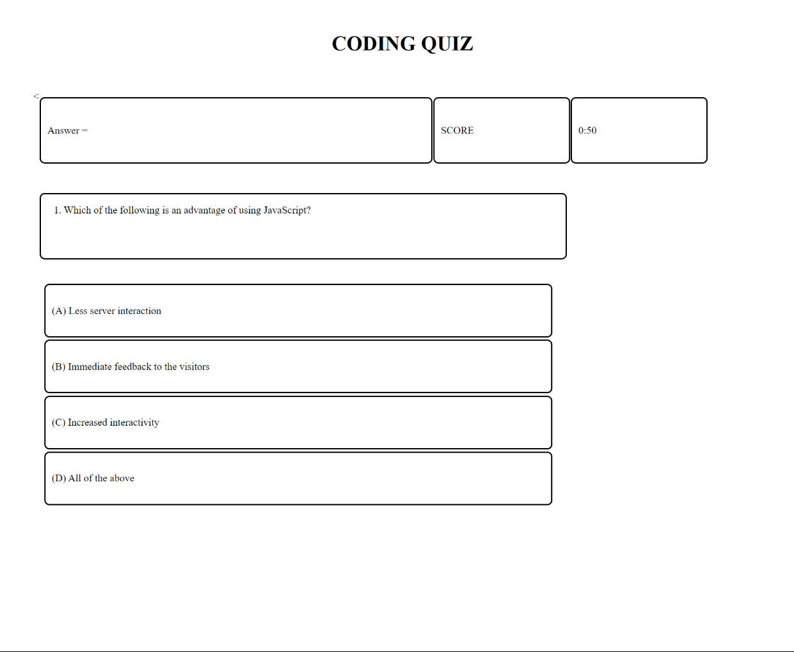

Coding Quiz

The Coding Coding App has 5 multiple choice questions with a time limit of 1 minute.
The quiz has a welcome notice with a button for the user to click.
After clicking the button, the user is presented with rules for the game and how it is played.
The Notice has a click button that enables the user to continue to the game.
Both the welcome and rule notices are hidden away revealing the new webpage. 
The visibility and hidden functions are initiated by the click event listeners.
When the player is at the main page the quiz page is divided into nine boxes.
The top boxes contain the place where the answer to the question is revealed momentarily before the 
program proceeds to the next question.
The two boxes to the right of the page hold the timer countdown and the users score.
Below that is the question box which displays the question.
Below that are the four multiple choice answers A B C and D.
THe user selects the answer chosen by clicking on the boxes.
The boxes background color changes to red for a wrong answer and green for the right answer
updating the score at the same time.
The program has a slight delay between question so as to allow the user to read or see briefly the right
answer.
If the user finishes all the question before the One minute is over the quiz will direct the user to a form to fill a 
form and save the score.
The questions and multiple choices are stored in an array. The program is able to pick the questions and 
multiple choices using indexes that are updated as the quiz updates.
The quiz has arrays for questions and multiple choices so as to enable future updates i.e. adding or removing 
questions.
The quiz is planned and designed in a flexible way to allow for future changes.
For the form section, I included local storage capabilities.
The User can input First and Last name plus the quiz score.
After clicking on the Submit button the user can view the key-value in your local storage.

